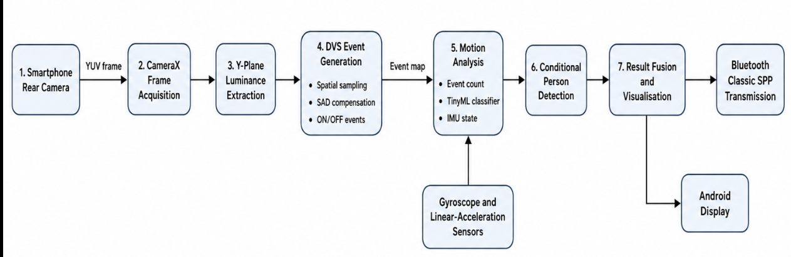
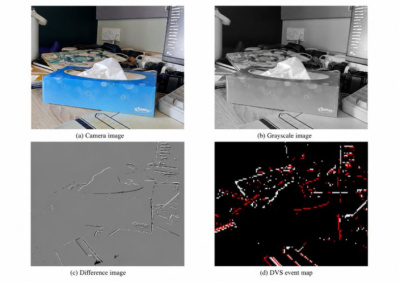
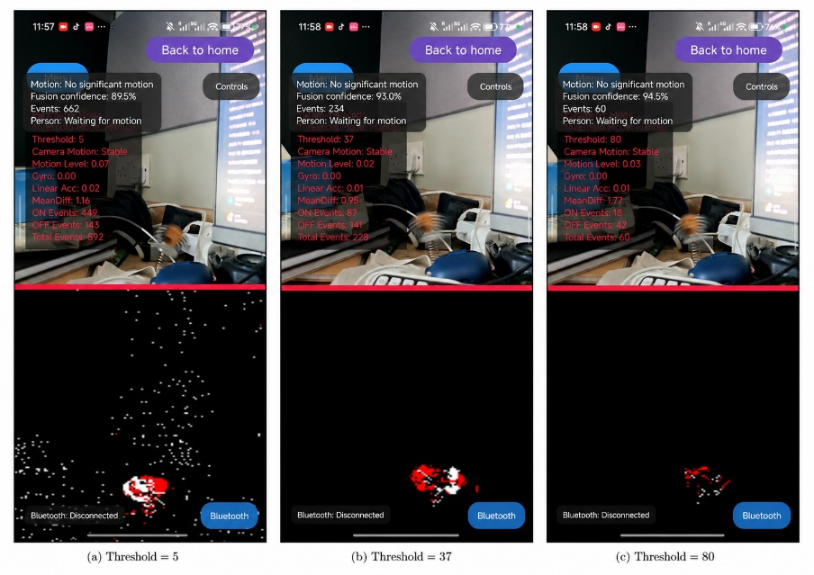
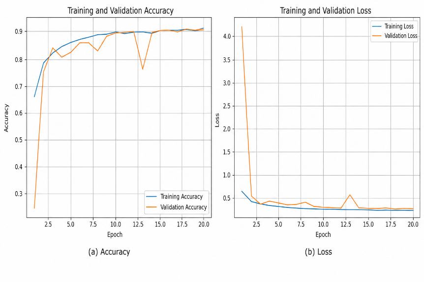
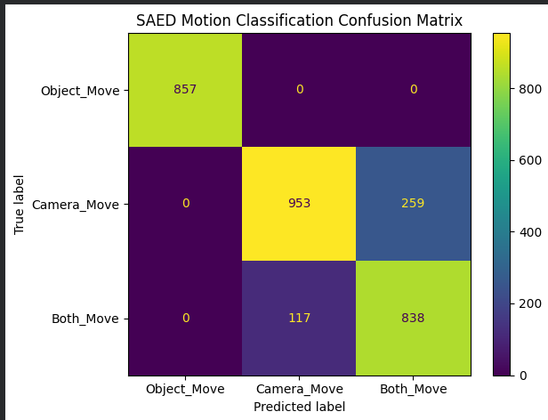
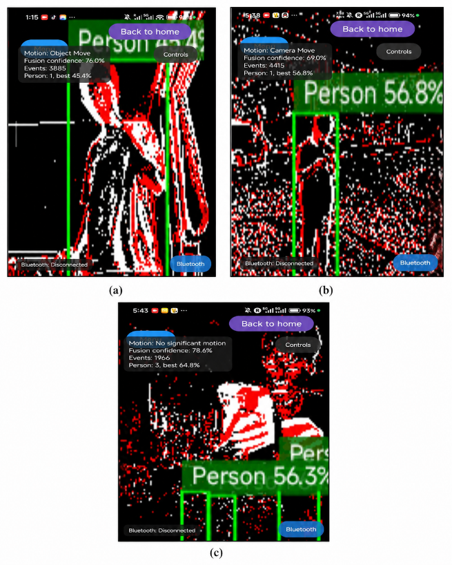

# Android DVS & Edge AI Vision System

[中文说明](README_CN.md)

A smartphone-based **Dynamic Vision Sensor (DVS) emulation and Edge AI vision system** developed for Android. The project uses a conventional smartphone camera to approximate event-based vision, performs motion analysis and person detection on-device, and supports wireless display of processed results.

> This project emulates DVS-like output from frame-based camera data. It is not a replacement for a hardware event camera.

## Overview

The system captures live frames using **Android CameraX**, extracts luminance information, and generates DVS-like **ON/OFF events** from temporal brightness changes. To improve robustness during handheld use, the pipeline combines adaptive thresholding, lightweight SAD-based translation compensation, and IMU-based camera-motion detection.

Two lightweight AI components are deployed directly on the phone:

- **Motion classification**: `Object_Move`, `Camera_Move`, and `Both_Move`
- **Person detection**: detects people on event-like images and overlays bounding boxes with confidence scores

The full image-processing and AI pipeline runs on the smartphone.

## System Architecture



The processing chain is:

`CameraX → Y-plane luminance → DVS event generation → motion analysis → conditional person detection → result fusion/visualisation`

Gyroscope and linear-acceleration data are used alongside visual processing for camera-motion awareness.

## Key Features

| Module | Function |
|---|---|
| Camera input | Real-time frame capture with CameraX |
| DVS emulation | Generates ON/OFF event maps from luminance changes |
| Adaptive thresholding | Adjusts event sensitivity based on local activity |
| Motion compensation | Lightweight SAD-based global translation estimation |
| IMU processing | Uses gyroscope and linear acceleration to detect phone movement |
| Motion AI | LiteRT/TFLite classifier for Object / Camera / Both movement |
| Person detection | On-device detection with bounding boxes and confidence |
| Visualisation | Camera, Grayscale, Difference, DVS and comparison views |
| Bluetooth output | Sends processed frames to an external Windows display |

## DVS Emulation

The DVS pipeline is implemented mainly in `DvsProcessor.kt`.

For each analysed camera frame, the current luminance image is compared with a stored reference image:

- **ON event**: brightness increase exceeds the threshold
- **OFF event**: brightness decrease exceeds the threshold
- **No event**: change remains below the threshold

The event view uses a sparse black background with different colours for ON/OFF activity.

### Processing Stages

The figure below shows the main output stages produced by the Android application: normal camera image, grayscale image, difference image and final DVS event map.



### Threshold Control

Both manual and adaptive threshold control are supported. A lower threshold increases sensitivity but also produces more background activity, while a higher threshold creates a sparser event map.



In the experiment shown above:

| Threshold | ON events | OFF events | Total events |
|---:|---:|---:|---:|
| 5 | 449 | 143 | 592 |
| 37 | 87 | 141 | 228 |
| 80 | 18 | 42 | 60 |

### Handheld Stability Improvements

**Adaptive thresholding**  
The automatic mode maintains adaptive event thresholds to reduce repetitive activity while preserving useful changes.

**SAD-based translation compensation**  
A lightweight Sum of Absolute Differences (SAD) search estimates small global x/y translations between frames so that minor handheld movement can be compensated.

**IMU-based camera-motion awareness**  
Gyroscope and linear-acceleration measurements are combined with image information to identify camera movement and make event generation more conservative when necessary.

**Spatial sampling**  
The luminance image is spatially sampled to reduce the computational load of running DVS generation, motion analysis, AI inference and visualisation on a single mobile device.

## Edge AI

### Motion Classification

`MotionClassifier.kt` loads `saed_motion_classifier.tflite` and performs on-device inference using LiteRT/TensorFlow Lite.

Model input:

```text
Shape: [1, 96, 128, 1]

Classes:
- Object_Move
- Camera_Move
- Both_Move
```

The lightweight CNN contains **5,763 parameters** and was converted to a TFLite model for mobile deployment.

#### Training Performance



Training and validation performance converged to around 0.90 accuracy. On the held-out test set, the final classifier achieved approximately **87.6% overall accuracy**.

#### Confusion Matrix



| Class | Precision | Recall | F1-score |
|---|---:|---:|---:|
| Object_Move | 1.000 | 1.000 | 1.000 |
| Camera_Move | 0.891 | 0.786 | 0.835 |
| Both_Move | 0.764 | 0.877 | 0.817 |

The main confusion occurs between `Camera_Move` and `Both_Move`, which is reasonable because both contain global camera-motion patterns.

### Person Detection

`PersonDetector.kt` loads `pedro_person_detector.tflite` and performs on-device person detection on accumulated event-like frames.



The examples show that the detector can localise a person when the event map contains a sufficiently coherent human contour. The current implementation can also produce false positives because the detector was trained using real event-camera data while the Android application generates frame-based DVS-like images.

Current deployment settings include:

```text
Input size: 320 × 320
Confidence threshold: 0.35
NMS IoU threshold: 0.40
Maximum detections: 3
```

## Display Modes

The Android application provides multiple visualisation modes:

- **Camera Only** — normal live camera preview
- **Grayscale** — luminance image
- **Difference** — motion-compensated frame difference
- **DVS Only** — DVS-like ON/OFF event map
- **Comparison** — camera and processed output together
- **Parameters** — processing statistics and motion information

Manual and automatic threshold controls are available from the application UI.

## Bluetooth Display

`BluetoothSenderManager.kt` transmits processed frames using Bluetooth Classic SPP. To avoid a growing backlog, the sender keeps only the newest pending frame.

Current transmission configuration:

```text
Maximum transmission rate: 15 FPS
Maximum image long edge: 320 px
JPEG quality: 35
Protocol: 4-byte big-endian JPEG length + JPEG data
```

In the end-to-end smartphone-to-PC experiment, the observed steady-state transmission rate was approximately **10.3–12.9 FPS**, with a mean of about **11.5 FPS**.

> The Bluetooth figure from the report is intentionally not included here because the original screenshot contains paired-device identifiers. A redacted version can be added later.

## Tech Stack

- Kotlin
- Android Studio
- Android CameraX
- Android Sensor API
- LiteRT / TensorFlow Lite
- Bluetooth Classic / SPP
- Gradle

## Requirements

- Android Studio
- Android SDK 36
- Minimum Android version: API 24 (Android 7.0)
- Android device with a camera
- Gyroscope and linear-acceleration sensors recommended
- Bluetooth required only for external-display functionality

## Getting Started

Clone the repository:

```bash
git clone https://github.com/JiaxuanJin/Android-DVS-EdgeAI-Vision-System.git
```

Open the project in Android Studio, allow Gradle to sync, connect a physical Android device, and run the `app` configuration.

The application requires camera permission. On Android 12 and later, Bluetooth connection permission is also required when using the external-display function.

The AI model files are stored in:

```text
app/src/main/assets/
├── motion_labels.txt
├── saed_motion_classifier.tflite
└── pedro_person_detector.tflite
```

## Project Structure

```text
app/src/main/
├── AndroidManifest.xml
├── assets/
│   ├── motion_labels.txt
│   ├── saed_motion_classifier.tflite
│   └── pedro_person_detector.tflite
├── java/com/example/framesenderapp/
│   ├── MainActivity.kt
│   ├── DvsProcessor.kt
│   ├── CameraMotionDetector.kt
│   ├── MotionClassifier.kt
│   ├── PersonDetector.kt
│   └── BluetoothSenderManager.kt
└── res/

docs/
└── figures/
    ├── system_architecture.png
    ├── dvs_processing_stages.png
    ├── threshold_comparison.jpg
    ├── motion_training_curves.png
    ├── motion_confusion_matrix.png
    └── person_detection_examples.png
```

## Limitations

This system approximates event-camera behaviour using consecutive frames from a conventional smartphone camera. Its temporal resolution is therefore limited by the camera frame rate and exposure pipeline, unlike a physical event sensor where pixels operate asynchronously.

Performance is also affected by camera movement, illumination changes, the domain gap between real event-camera data and smartphone-generated event maps, mobile-device computational resources, and wireless transmission bandwidth.

## Future Work

Possible extensions include:

- Improve event generation under large illumination changes
- Improve camera-motion compensation
- Fine-tune the detector using labelled smartphone-generated event maps
- Quantise or hardware-accelerate the AI models
- Add obstacle and distance estimation
- Add audio or haptic feedback for assistive navigation
- Improve wireless streaming latency

## Author

**Jiaxuan Jin**

Developed as an MSc Final Project in Electronic & Electrical Engineering at the University of Sheffield, focusing on smartphone-based event-vision emulation and on-device Edge AI.
